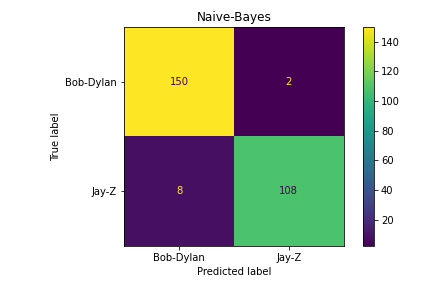
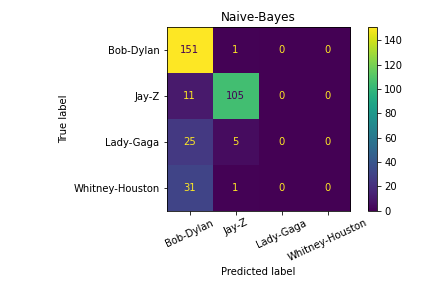
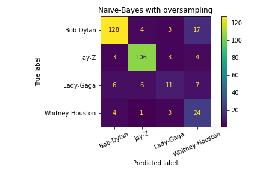

# Classifying lyrics using Naive Bayes

Bike sharing demand
---------------------------
This project classifies song lyrics scraped from the web as belonging to a particular artist. The concept is based on a bag of words model, i.e. any artist will likely have particular words they frequently use, by which the model can identify them.

I build a simple machine learning model using Naive-Bayes and logistic regression. In particular, I show:
  - how the bag of words concept creates features based on word counts
  - how sampling techniques play an important role in unbalanced data sets.

**Scroll down for some key takeaways.**

**View the project in the following order:**
1. Lyrics_classification_part1.ipynb
    - follow the concept behind bag of words put to practice
2. Lyrics_classification_part2.ipynb
    - follow the creation of several pipelines to compare performance of different sampling techniques

View the analyses directly by clicking the jupyter notebook files in the GitHub repository!
  - GitHub renders the files for immediate viewing
  - It might take a few seconds to render and/or you might have to hit `reload` if rendering is unsuccessful
  - The following installation steps are only necessary if the code is to be executed by the user

Installation
---------------------------

### Download the data

* Clone this repo to your computer
* Get into the folder using `cd Classifying-lyrics-using-Naive-Bayes`
* Execute the webscraping script from your terminal by typing: `python webscraping.py`
  * Careful! Scraping the lyrics can take several hours!

### Install the requirements

* Install the requirements using `pip install -r requirements.txt`
    * Make sure you use Python 3.6.8
    * You may want to use a virtual environment for this
    * You may have to downlaod Spacy's en_core_web_sm model
      * See https://github.com/explosion/spacy-models

Usage
-----------------------
* Open any notebook using `jupyter-lab notebook.ipynb`
* Run notebook by selecting Kernel -> Restart Kernel and Run All Cells

Key takeaways
-----------------------

- Bag of words leads to very large dimensions of several thousand feature (transformed relative word count) columns
- __Figure 1__ shows the confusion matrix for classifying songs as belonging to either Bob Dylan or Jay Z using Naive Bayes without oversampling. The training data contains 454 Bob-Dylan songs and 349 Jay-Z songs.
  - As we can see, only few test samples are misclassified
- __Figure 2__ shows the confuson matrix for 4 different artists using Naive-Bayes without oversampling underrepresented classes. The training data is enhanced with 97 Whitney Houston samples and 89 Lady Gaga sample.  
  - Naives Bayes fails to classify the underrepresented artists
- __Figure 3__ shows the confusion matrix for the same 4 artists using Naive-Bayes and random oversampling, which oversamples the underrepresented classes to obtain 454 training samples for each artist
  - Naive Bayes with random oversampling does a better job at classifying the underrepresented classes, although precision and recall scores are still worse
- SMOTE is an oversampling technique which creates new data points based on k nearest neighbours. SMOTE performs better than random oversampling, in particular for a larger number of artists
- Logistic Regression achieves a comparable outcome using balanced class weights as a parameter

## Figure 1:

## Figure 2:

## Figure 3:

